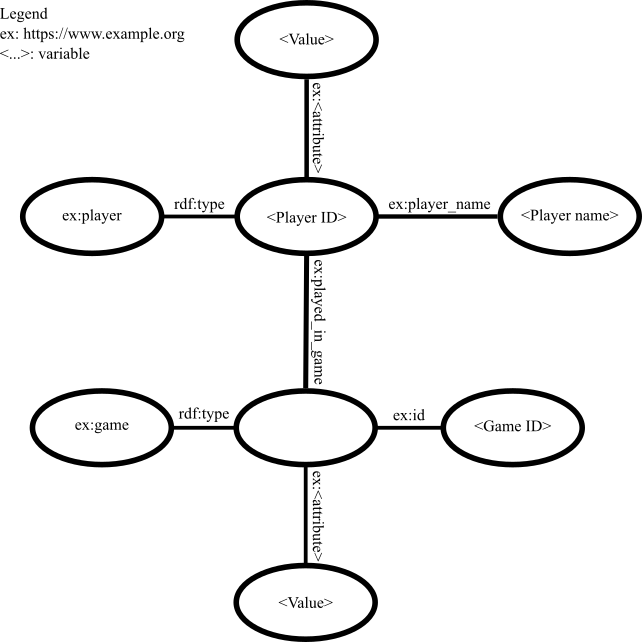

Before running the code, download the CSV data files from [Kaggle](https://www.kaggle.com/datasets/davidcariboo/player-scores/data), and place them into "./archive/". The code will load this data, clean it, create a knowledge graph from it, and perform a query on the knowledge graph in order to obtain the information required for answering the research questions: "Does football player valuation always hing on their performance?" and "Are some football players overvalued?".

